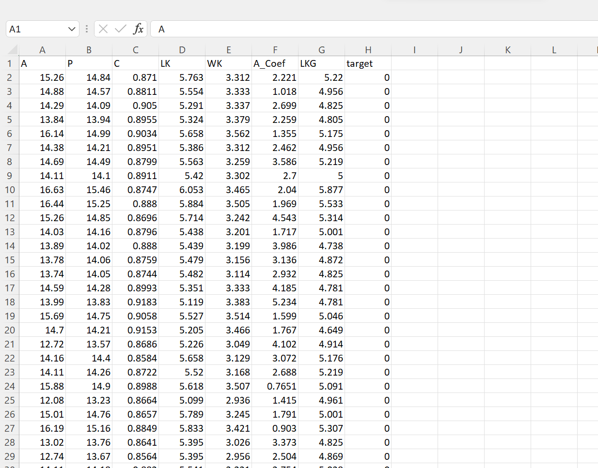
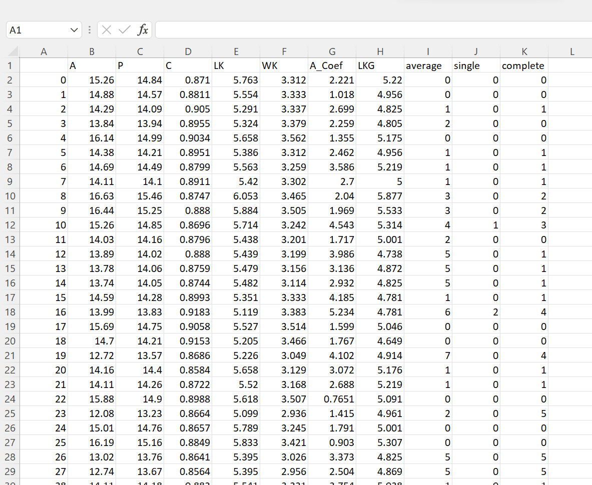
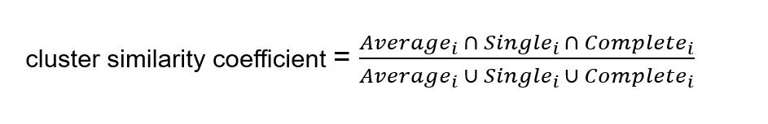
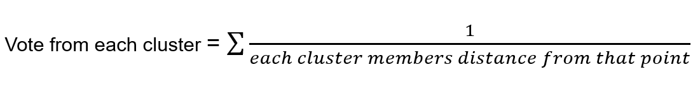
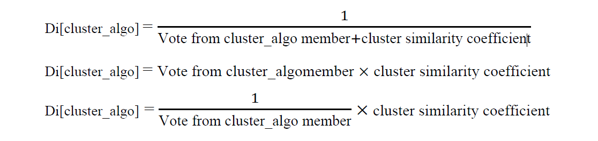
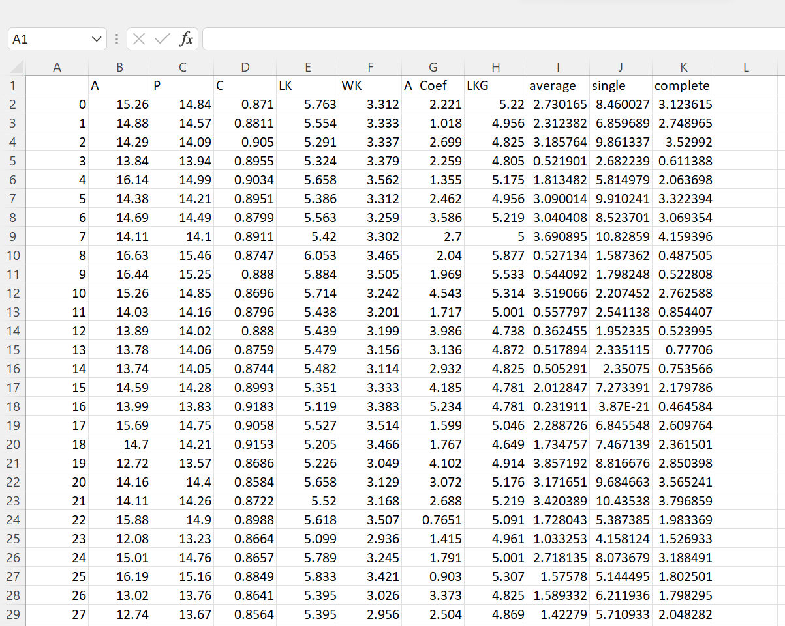
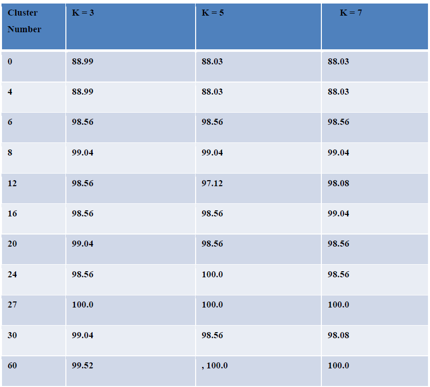
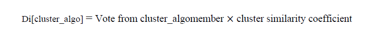
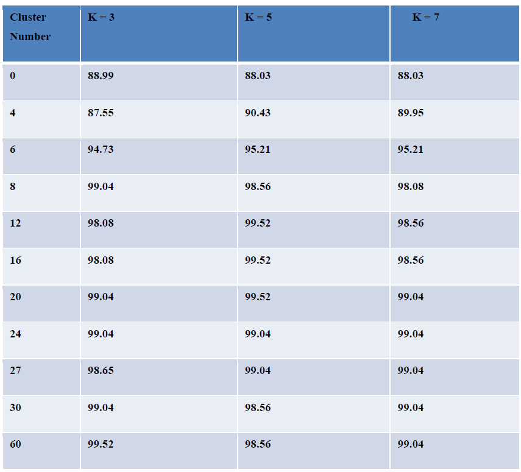

# Hierarchical-Multi-Clustering-guided-KNN-Classification-for-Seed-Categorization

**Description:**

This seed categorization project utilizes Hierarchical Clustering and KNN to achieve high accuracy in predicting the correct seed. First, I applied three hierarchical clustering using different linkage criteria on the dataset. Then, with that clustering, I built a new feature vector upon which I applied KNN classification to categorize the seeds.

**Procedures:**

1. First, I have used Hierarchical Clustering with three different linkage criteria to generate a new feature vector that adds the cluster labels with the original feature vector. The three linkage criteria are average (weighted average), single, and complete. Then, I created a new column in the feature vector for each type of clustering and added the cluster id of each data point in that new column. Below, we can see the three new columns added to the original dataset.

  After applying cluster:

2. After this, I calculated two parameters to determine the similarity between clusters and a data point. The first parameter obtains the similarity measurement between clusters to which the data point belongs. To measure this, we calculate how many item intersections the clusters have among them in proportion to their combine item numbers. Given a data point the following equation gives us the parameters. For a data point D(i) we get the similarity coefficient,

3. Additionally, another similarity measurement is calculated by the cluster member votingmechanism. Each data point gets a vote from each of the clusters they belong. The vote is calculated by summing up the inverse of the distance between that data point and all other members of a particular cluster. For a data point D(i) we get the Vote,

4. This two-similarity measurement is encoded in the data point in place of their respective cluster id. I experimented with a couple of formulas to encode those similarities information. For datapoint di,

5. With this we get new feature vector.

6. Subsequently, this new feature vector has been used to perform KNN classification.

7. I used several cluster numbers and three KNN value to generate the prediction accuracy for seed species.

**Result:**

Using this equation to consider similarity information we get the following result:

Using this equation to consider similarity information we get the following result:

In both table, first row has the KNN classification accuracy for the original data without clustering. The other rows contain prediction accuracy with different numbers of clusters. Here we can see that we are getting significantly higher accuracy with the Hierarchical Multi Clustering guided KNN Classification than only KNN classification without clustering.

**Conclusion:**

From the result we can conclude that guiding KNN Classification with Hierarchical multi clustering we can improve the prediction accuracy significantly.
